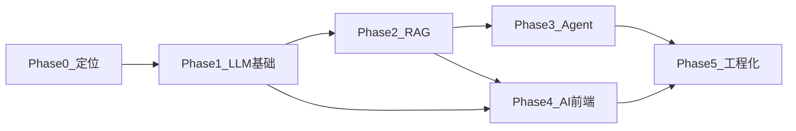

# 前端转 AI 工程师学习路线（分阶段学习路径）

## 总定位

目标角色：**AI 应用工程师 / AI Fullstack**（不是算法研究员）。

- 主线：LLM API → RAG → Agent/Tool Calling → AI 原生前端
- 技术栈默认：**Vue3 + Vite + Express（TS）**，模型用 **DeepSeek**（OpenAI 兼容）；中期补一点 Python
- 原则：每个阶段都有「学什么 → 看什么 → 做什么 → 怎样算过关」



---

## 阶段 0：定位与能力地图（约 1 周）

### 目标

搞清「AI 应用工程师」做什么，避免一上来刷数学/训练模型。

### 学习路径（按天）

1. **Day 1–2：角色认知**
   - 区分：提示词使用者 / AI 应用工程师 / 算法工程师
   - 理解你的优势：交互、工程落地、端到端交付
2. **Day 3–4：能力拆解**
   - Prompt 与产品流程
   - RAG 数据流
   - Agent 工具编排
   - AI UX（流式、引用、失败态）
3. **Day 5–7：定目标与仓库**
   - 写下 3 个月目标作品（知识库问答 Web + 小程序）
   - 建一个空 GitHub 仓库，写 README 学习日志模板

### 推荐资源

- DeepSeek「Chat Completions」官方文档（已选定）
- 一篇高质量 RAG 概述（检索增强生成是什么、为什么需要）
- 观察 1–2 个产品交互：ChatGPT、Cursor、任意开源知识库 UI

### 练习

- 用一页纸画出「用户提问 → 检索 → 生成 → 前端展示引用」的流程图
- 列出你最熟悉的业务场景，写 3 个可做成 RAG 的题目

### 验收标准

- 能口头说清：自己要做的是应用工程，不是训练大模型
- 有明确主作品定义（例如：团队文档问答）

---

## 阶段 1：LLM 应用基础（2–3 周）

### 目标

稳定调用模型 API，做出可中断的流式聊天，并掌握结构化输出。

### 学习路径（按周）

**Week 1：协议与非流式调用**

1. 学：messages 角色、temperature、max_tokens、上下文窗口、token 计费
2. 看：所选厂商 OpenAI 兼容 API 文档（chat/completions）
3. 做：Node/TS 写一个 `/api/chat`，非流式往返成功
4. 过关：能解释一次请求里 system/user 各起什么作用

**Week 2：流式与前端联调**

1. 学：SSE、ReadableStream、AbortController、背压/断流处理
2. 看：Fetch streaming / EventSource 相关文档；Vue3 中的异步状态管理
3. 做：Vue3 聊天页（消息列表、打字机、停止生成、重试）
4. 过关：弱网下能取消请求，UI 不卡死、不错乱消息顺序

**Week 3：结构化输出与安全边界**

1. 学：JSON mode / schema、基础 function calling 概念、提示注入、幻觉
2. 看：Structured Outputs 文档；一篇 prompt injection 入门文
3. 做：小工具「文本 → 固定 JSON 字段」；加简单 system 防护提示
4. 过关：模型乱输出时，你有校验与降级（解析失败重试/提示用户）

### 知识清单（必须掌握）

- Token、上下文、温度、top_p（会调、知影响即可）
- 流式协议与取消
- Prompt 分层：系统约束 / 任务说明 / 用户输入
- 成本与延迟直觉（为什么要控制上下文长度）

### 推荐资源（少而精）

1. DeepSeek 官方 API 文档（Chat Completions / 流式，第一优先）
2. OpenAI Cookbook 中「streaming」「structured output」类示例（DeepSeek 协议兼容，可对照）
3. MDN：ReadableStream / AbortController
4. Vue3 官方文档：响应式与组件状态（你已熟悉，重点看异步 UX）

### 阶段项目

**项目 A：流式 Chat Demo**

- 技术：Vue3 + Vite + Express（TypeScript）+ DeepSeek
- 功能：多轮对话、流式、停止、错误重试、简单 system prompt 切换

### 验收标准

- [ ] 完整可演示的流式聊天
- [ ] 至少 1 个结构化输出练习
- [ ] README 写清：如何配置 API Key、架构、已知问题

---

## 阶段 2：RAG 主线（4–6 周，最重要）

### 目标

独立实现「文档入库 → 向量检索 → 带引用回答」，并会做基础评测。

### 学习路径（按周）

**Week 1：手工最小 RAG（禁止先上大框架）**

1. 学：Embedding 是什么、余弦相似度、Chunk 为什么要切、Top-K
2. 看：Embedding API 文档；一篇「chunking 策略」短文
3. 做：
   - 准备 10–20 篇 Markdown
   - 按字数/标题切分
   - 调 embedding，结果存 JSON/内存
   - 用户提问 → 向量检索 Top-K → 拼 prompt → 回答
4. 过关：能画出数据流，并能指出「回答来自哪几个 chunk」

**Week 2：工程化存储与文档生命周期**

1. 学：向量库基本概念（collection、metadata、过滤）
2. 看：pgvector 或任一托管向量库入门文档
3. 做：上传文档、重建索引、删除文档、按 metadata 过滤
4. 过关：换一份文档集，不用改核心代码即可重建知识库

**Week 3：检索质量与回答约束**

1. 学：语义切分、重叠窗口、Hybrid Search（关键词+向量）、Rerank（了解）
2. 看：一篇 Hybrid Search 概述；Rerank 产品文档扫一眼即可
3. 做：
   - 优化切分（按标题层级）
   - 无相关结果时拒答
   - 前端引用卡片（文件名、片段、跳转）
4. 过关：准备 20 题人工集，正确引用率肉眼可见提升

**Week 4–5：会话、权限与产品化**

1. 学：短期对话记忆 ≠ 长期知识；权限过滤在检索层做
2. 做：多轮追问、用户只能检索自己有权限的文档
3. 过关：能解释「为什么不能把整库塞进 context」

**Week 6（可选加速）：引入薄框架**

1. 学：LangChain / LlamaIndex 对应你已手写的模块如何映射
2. 原则：用框架减少样板代码，不替代你对 pipeline 的理解
3. 过关：能说出框架里 Retriever / Document Loader 对应你代码的哪一段

### 知识清单（必须掌握）

```text
文档 → 解析 → Chunk → Embedding → 向量库
                ↓
用户问题 → Embedding → 检索 Top-K → (可选 Rerank)
                ↓
拼 Prompt（系统约束+引用片段+问题）→ LLM → 带 citation 的回答
```

### 推荐资源

1. Embedding / Chat 官方 API 文档
2. pgvector 官方 README 或 Pinecone/云向量库 Quickstart（二选一深挖）
3. 手写 RAG 教程或博客（优先短、有完整代码路径的）
4. 「RAG 评测」入门：准确率、拒答、幻觉抽样（先定性后定量）
5. 框架文档留到 Week 6，不要 Week 1 就陷入 LangChain 抽象

### 阶段项目

**项目 B（主作品）：团队/个人知识库问答（Vue3）**

- 上传 MD/TXT（可后续加 PDF）
- 检索问答 + 引用展示
- 基础评测表（20 问：是否答对、是否有依据、是否胡编）

### 验收标准

- [ ] 手写版 pipeline 跑通
- [ ] 向量库持久化
- [ ] 前端可见引用来源
- [ ] 有简单评测记录（表格即可）
- [ ] 能讲清 3 个失败案例及你的改进

---

## 阶段 3：Agent 与工具调用（3–4 周）

### 目标

让模型「会调用工具做事」，而不仅是「根据检索文本说话」。

### 学习路径（按周）

**Week 1：单工具 Function Calling**

1. 学：tools 定义、参数 schema、tool_calls 往返协议
2. 看：厂商 Function Calling / Tools 官方文档 + 1 个完整示例
3. 做：一个工具，例如 `getWeather(city)` 或 `searchDocs(query)`（可先 mock）
4. 过关：完整闭环：模型决定调用 → 你执行 → 把结果回灌 → 最终自然语言回答

**Week 2：多工具路由与失败处理**

1. 学：工具选择错误、参数非法、超时、重试、最大步数限制
2. 做：至少 2 个工具（如 `ragSearch` + `webSearch` 或 `getTime`）
3. 过关：工具失败时有友好降级，不会死循环

**Week 3：人机确认与业务 Agent**

1. 学：高风险操作需确认；Agent 状态机（idle / calling / waiting_user）
2. 做（任选其一做深）：
   - 文档问答 + 必要时联网补充
   - 前端报错助手（贴 stack → 查知识库 → 给步骤）
   - 表单助手（自然语言填表、校验字段）
3. 过关：前端能展示「正在调用某某工具」中间态

**Week 4：轻量编排，不上重框架也可**

1. 学：ReAct 思想（Reason + Act）；何时需要图编排（LangGraph 等）
2. 看：一篇 ReAct 短文；LangGraph 仅作了解
3. 做：把项目 B 升级为「RAG + 1～2 Tools」
4. 过关：简历上能写清工具列表、限制与安全策略

### 知识清单

- Tool schema 设计（名称、描述、参数要比模型好懂）
- 多步调用的终止条件
- 观察-行动循环
- 权限与确认（删除、发消息、写库等）

### 推荐资源

1. 官方 Tool Calling 文档（必读）
2. OpenAI / 同类 Cookbook 的 function calling 示例
3. ReAct 论文摘要或图文解读（了解思想即可）
4. 暂缓：复杂 Multi-Agent 框架、一堆编排平台

### 阶段项目

**项目 C：带工具的轻量 Agent**

- 在知识库问答上增加 1–2 个工具
- UI 展示工具调用轨迹

### 验收标准

- [ ] 至少 2 个真实可执行工具
- [ ] 有最大步数/超时保护
- [ ] 有至少 1 个需用户确认的操作（或明确说明为何不需要）

---

## 阶段 4：AI 原生前端能力（贯穿全程，集中强化约 2 周）

### 目标

把 Vue/Taro 经验变成差异化：不只是「调 API 的页面」，而是可复用的 AI 交互层。

### 学习路径（按模块，可与阶段 1–3 并行）

**模块 A：流式与会话状态（3–4 天）**

1. 学：消息不可变更新、请求世代（generation id）、乱序保护
2. 做：`StreamingText`、停止生成、编辑消息并重发
3. 过关：快速连续发送多条时 UI 不错位

**模块 B：富内容渲染（3–4 天）**

1. 学：Markdown 安全渲染、代码高亮、表格、XSS 风险
2. 做：消息气泡支持 MD/代码块；引用列表组件 `CitationList`
3. 过关：恶意 HTML 不会被执行

**模块 C：工具态与可解释性（3–4 天）**

1. 学：中间态设计（检索中、调用工具中、等待确认）
2. 做：`ToolCallStatus`；可选展示检索到的 chunk
3. 过关：用户能理解「模型正在干什么」

**模块 D：Taro 移动端（4–5 天）**

1. 学：小程序流式限制、包体积、鉴权、弱网
2. 做：项目 B 的精简版小程序端（问答 + 引用）
3. 过关：真机可演示；说明与 Web 端能力差异

### 组件库目标（建议沉淀）

- `ChatWindow`
- `MessageBubble`
- `StreamingText`
- `CitationList`
- `ToolCallStatus`

### 推荐资源

1. 你现有 Vue3 组件化经验（主资源就是多做）
2. markdown-it / markdown-it + DOMPurify 一类安全渲染实践
3. Taro 官方：网络请求、分包、权限
4. 研究 2 个优秀 Chat UI 的交互细节（停止、重试、引用）

### 验收标准

- [ ] 可复用组件至少 4 个
- [ ] Web 完整；Taro 有可演示精简版
- [ ] 对「流式 + 引用 + 工具态」有统一设计

---

## 阶段 5：工程化、评测与作品包装（2–3 周，穿插进行）

### 目标

让项目「能上线、能复盘、能写进简历」，而不是只能本机 demo。

### 学习路径（按主题）

**主题 1：可观测性（3–4 天）**

1. 学：记录 prompt、检索 hit、延迟、token、错误码（注意脱敏）
2. 做：每次问答落一条 debug 日志（开发环境可看）
3. 过关：出 bug 时能定位是检索差还是生成差

**主题 2：稳定性与成本（3–4 天）**

1. 学：超时、限流、降级模型、短时缓存
2. 做：API 超时重试；简单同问缓存；展示本次 token 消耗
3. 过关：模型慢/挂时有明确 UI 与后端策略

**主题 3：评测回归（4–5 天）**

1. 学：固定题集、改 chunk 前后对比、主观+抽样
2. 做：20–50 题评测表；改动策略后复跑
3. 过关：能证明「某次改动让引用准确率上升」

**主题 4：作品集与面试表达（3–4 天）**

1. 学：如何讲清架构、权衡、失败案例
2. 做：每个项目 README：架构图、数据流、评测、局限、下一步
3. 过关：3 分钟讲完主作品；10 分钟深挖 RAG 细节不慌

### 推荐资源

1. 任意 APM/日志实践（先用结构化 console/文件日志即可）
2. RAG 评测相关短文（hit rate、faithfulness 概念级）
3. 优秀开源知识库项目的 README（学怎么呈现）

### 作品集顺序（最终对外）

1. 流式 Chat + 结构化输出
2. 知识库 RAG（主作品）
3. Taro 端精简版
4. RAG + Tools Agent

### 验收标准

- [ ] 主作品有架构图与评测记录
- [ ] 有成本/延迟/错误处理说明
- [ ] GitHub 可被他人按 README 跑起来

---

## 总时间与每周节奏（在职）

假设每周 **10–12 小时**：

| 投入          | 比例 |
| ------------- | ---- |
| 动手做项目    | 40%  |
| 读文档/看概念 | 30%  |
| 评测与复盘    | 20%  |
| 看产品与案例  | 10%  |

大致节奏：

- 第 1 个月：阶段 0–1 + RAG Week1–2
- 第 2 个月：RAG 做完 + 前端组件强化
- 第 3 个月：Agent + 工程化 + Taro
- 第 4 个月：打磨作品与面试表达

---

## 已确定主栈

| 层 | 选型 |
|----|------|
| 前端 | Vue 3 + Vite + TypeScript |
| 后端 | Node.js + Express + TypeScript |
| 模型 API | DeepSeek（OpenAI 兼容协议；先定死，不频繁换） |
| RAG 短期存储 | JSON / 内存（手写最小 RAG） |
| RAG 中期向量库 | pgvector（或托管向量库，二选一） |
| 包管理 | pnpm 或 npm（二选一固定） |

当前阶段不上：Nuxt 作主后端、Hono；未手写通 RAG 前不上 LangChain / Multi-Agent。

## 技术栈衔接策略

- **短期**：Vue3 + Vite + Express（TS）+ DeepSeek（迁移成本最低）
- **中期**：补 Python 基础语法 + 脚本（数据处理、批量评测更方便）
- **长期**：需要时再接触微调；多数岗位仍以 RAG + Agent + 产品化为主

## 明确不要先做的事

- 先刷大量高等数学 / 从零训练模型
- 同时学多个 Agent 重框架
- 没做通手写 RAG 就上 Multi-Agent
- 只聊天、没有可演示仓库
- 在 Hono / Nuxt / 多模型厂商之间反复纠结

## 第一个 30 天执行清单

1. 用 DeepSeek + Express，完成阶段 1 流式 Chat
2. 10 篇文档手写最小 RAG
3. 前端加上引用展示
4. 仓库 README 固化架构与日志
5. 进入向量库持久化与上传文档
